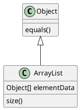
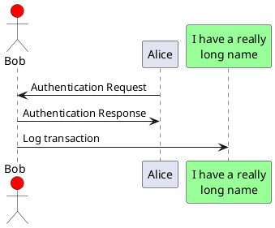
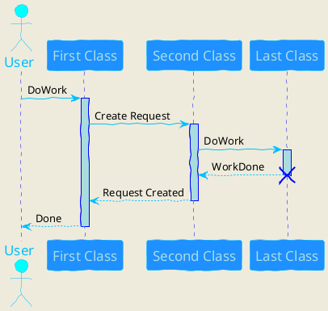

# Diagrams

Drawing diagrams is not supported by default and requires 3rd party plugins

## Nomnoml pluign

Source: https://plugins.gitbook.com/plugin/nomnoml-md

```nomnoml

#fill: #d5e7ee; #8ebff2

[<frame>Decorator pattern|
  [<abstract>Component||+ operation()]
  [Client] depends --> [Component]
  [Decorator|- next: Component]
  [Decorator] decorates -- [ConcreteComponent]
  [Component] <:- [Decorator]
  [Component] <:- [ConcreteComponent]
]
```

```nomnoml
[Pirate|eyeCount: Int|raid();pillage()|
  [beard]--[parrot]
  [beard]-:>[foul mouth]
]

[<abstract>Marauder]<:--[Pirate]
[Pirate]- 0..7[mischief]
[jollyness]->[Pirate]
[jollyness]->[rum]
[jollyness]->[singing]
[Pirate]-> *[rum|tastiness: Int|swig()]
[Pirate]->[singing]
[singing]<->[rum]

[<start>st]->[<state>plunder]
[plunder]->[<choice>more loot]
[more loot]->[st]
[more loot] no ->[<end>e]

[<actor>Sailor] - [<usecase>shiver me;timbers]
```

## Plant UML

Source: https://plugins.gitbook.com/plugin/graphviz-and-plant-uml

This library make break build as it requires 3rd party libs (including Java). The `book.json` config files assumes MacOS file structure.

It's a very powerful library but adds visible latency to documentation build process. It's also initialising desktop Java app for every diagram which distracts workflow. Perhaps it's possible to modify the plugin to initialise Java in background.

### Installing 3rd party dependcies on MacOS

```bash
$ brew install graphviz
$ brew install plantuml
```

### Diagram






